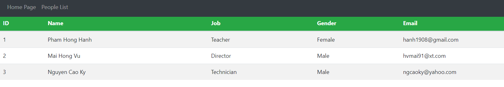

# Phần 1: Hiện list trên website thông qua Thymeleaf. Trang trí cơ bản thông qua Bootstrap

<a id = "p0"></a>

## Mục lục

- [Khai báo chung cho class Person](#p1)
- [Khai báo abstract class DAO và class ListPerson](#p2)
- [Khai báo class controller cho Thymeleaf](#p3)
- [Trang trí bằng bootstrap](#p4)
- [Soạn trang index.html](#p5)
- [Soạn trang peopleList](#p6)

<a id ="p1"></a>

## Khai báo chung cho class Person

```java
@Data
@NoArgsConstructor
@AllArgsConstructor
public class Person {
    private int id;
    private String name;
    private String job;
    private String gender;
    private String email;
}
```

[**Quay về mục lục**](#p0)

<a id ="p2"></a>

## Khai báo abstract class DAO và class ListPerson

- Với abstract class DAO

```java
@Repository
public abstract class DAO<T> {
    List<T> listPerson = new ArrayList<T>();

    public abstract List<T> getAll();
}
```

- Với class ListPerson `extends` từ class DAO

```java
@Component("list")
public class ListPerson extends DAO<Person> {

    public ListPerson() {
        listPerson.add(new Person(1, "Pham Hong Hanh", "Teacher", "Female", "hanh1908@gmail.com"));
        listPerson.add(new Person(2, "Mai Hong Vu", "Director", "Male", "hvmai91@xt.com"));
        listPerson.add(new Person(3, "Nguyen Cao Ky", "Technician", "Male", "ngcaoky@yahoo.com"));
    }

    @Override
    public List<Person> getAll() {
        return listPerson;
    }
}
```

[**Quay về mục lục**](#p0)

<a id ="p3"></a>

## Khai báo class controller cho Thymeleaf

- Khai báo chung

```java
@Controller
public class ThymeController {
    @Autowired
    @Qualifier("list")
    private DAO<Person> peopleDAO;}
```

- Khai báo cho GET request dến trang `index.html`

```java
    @GetMapping(value = { "/", "/index", "/home" })
    public String homePage(Model model) {
        model.addAttribute("title", "Home Page");
        return "index";
    }
```

Trong đó :

- `@GetMapping(value = { "/", "/index", "/home" })`
  khai báo hàm này sẽ xử lý các câu lệnh GET từ các HTTP request sau đây: `/`, `/index`, hay `/home`

- `model.addAttribute("title", "Home Page");` là câu lệnh để truyền vào giá trị `title` một string là `"Home Page"` từ đó truyền vào trang html.

- Khai báo cho GET request đến trang `peopleList.html`

```java
    @GetMapping("/list")
    public String readAllPage(Model model) {
        model.addAttribute("title", "List of people");
        model.addAttribute("list", peopleDAO.getAll());
        return "peopleList";
    }
```

Tương tự, ở đây có 2 giá trị được truyền vào : `title` với giá trị là `"List of people"`; và `list` với giá trị là arrayList được trả về thông qua method `peopleDAO.getAll()`

[**Quay về mục lục**](#p0)

<a id ="p4"></a>

## Trang trí bằng bootstrap

- Trang hướng dẫn cú pháp bootstrap: [getBootstrap](https://getbootstrap.com/docs/4.0/getting-started/introduction/) | [w3schools](https://www.w3schools.com/bootstrap4/)

- Để thuận tiện cho việc code, chúng ta sẽ tạo ra file `template.html` để chứa template trước. Đồng thời tạo ra trong thư mục static file `/css/myStyle.css`

- Với file `myStyle.css` trong thư mục con css của thư mục static

```css
div.content {
  padding-top: 50px;
}

li.nav-item:hover {
  background-color: rgba(75, 68, 68, 0.404);
}
```

- Để sử dụng được bootstrap, ta sẽ chèn thẻ `link` sau đây trong thẻ `head`

```html
<link
  rel="stylesheet"
  href="https://stackpath.bootstrapcdn.com/bootstrap/4.1.3/css/bootstrap.min.css"
  integrity="sha384-MCw98/SFnGE8fJT3GXwEOngsV7Zt27NXFoaoApmYm81iuXoPkFOJwJ8ERdknLPMO"
  crossorigin="anonymous"
/>
```

- Để sử dụng được file css vừa khai báo, ta cần thêm thẻ `link` sau, cũng trong thẻ `head`

```html
<link rel="stylesheet" th:href="@{/css/myStyle.css}" />
```

- Nếu xem lại câu lệnh trong `ThymeController`, để ý có dòng như sau ở trong cả 2 `GetMapping` method

```java
  model.addAttribute("title", "Home Page");
```

Lúc này ta sẽ lấy giá trị được truyền vào biến `title` từ controller này lên vào title thông qua cú pháp như sau

```html
<title th:text="${title}">Title</title>
```

- Đánh dấu thẻ head này là fragment với tên là `Heading`

```html
<head th:fragment="Heading"></head>
```

- Thiết kế phần navigation bar và để trong cặp thẻ div đánh dấu fragment là `navBar`

```html
<div th:fragment="navBar">
  <nav class="navbar navbar-expand-sm navbar-dark bg-dark fixed-top">
    <ul class="navbar-nav">
      <li class="nav-item">
        <a class="nav-link" th:href="@{/index}"> Home Page</a>
      </li>
      <li class="nav-item">
        <a class="nav-link" th:href="@{/list}"> People List</a>
      </li>
    </ul>
  </nav>
</div>
```

[**Quay về mục lục**](#p0)

<a id ="p5"></a>

## Soạn trang `index.html`

- Đầu tiên tạo ra thẻ `<html>` để chứa tất cả các nội dung của trang
- Vởi thẻ `head`, thay vì viết thì ta sẽ dùng thẻ `head` đã soạn trước từ `template.html` như sau:

```html
<head th:replace="template::Heading"></head>
```

- Tạo ra thẻ `body` trong thẻ `html`. Thẻ này sẽ chứa thẻ 2 thẻ `div` : `navbar` và `content`

  - Tương tự thẻ `head`, ta sẽ dùng lại thẻ navBar đã được viết ở `template.html`:

  ```html
  <head th:replace="template::Heading"></head>
  ```

  - Trong thẻ `div content`, ta sẽ cho nội dung của trang vào. Với `index.html` sẽ có nội dung đơn giản như sau

  ```html
  <h1>Hello world</h1>
  ```

- Kết quả của trang html


[**Quay về mục lục**](#p0)

<a id ="p6"></a>

## Soạn trang peopleList

- Gần tương tự với cách soạn trang index, nhưng ở có 2 sự thay đổi

  - Đối với bản thân thẻ `div content`, thêm thuộc tính `align="center"`

    <div class="content" align="center">

  - Trong thẻ `div content`, ta thay thế nội dung như sau

```html
<table class="table table-striped w-auto">
  <thead class="bg-success text-white">
    <tr>
      <th>ID</th>
      <th>Name</th>
      <th>Job</th>
      <th>Gender</th>
      <th>Email</th>
    </tr>
  </thead>
  <tbody class="tbody">
    <tr th:each="person, iStat:${list}">
      <td th:text="${iStat.count}">No.</td>
      <td th:text="*{person.name}">Name</td>
      <td th:text="*{person.job}">Job</td>
      <td th:text="*{person.gender}">Gender</td>
      <td th:text="*{person.email}">Email</td>
    </tr>
  </tbody>
</table>
```

- Giải thích các cú pháp được sử dụng: [loda.me](https://loda.me/spring-boot-9-giai-thich-cach-thymeleaf-van-hanh-expression-demo-full-loda1558267496214/) | [techmaster.vn](https://techmaster.vn/posts/36647/lap-trinh-thymeleaf-view-template-cho-spring-boot-web-app)

- Kết quả



[**Quay về mục lục**](#p0)
