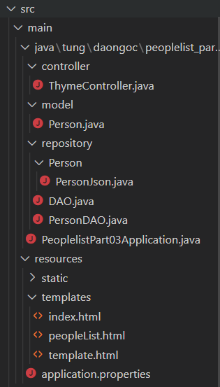
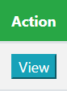
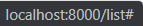
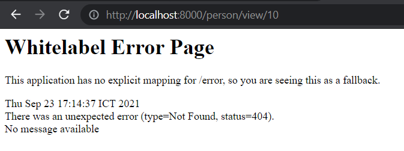
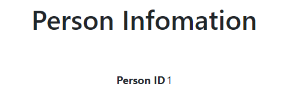

# Phần 3: View data của một đối tượng trong bảng

## Mục lục

<a id="p0"></a>

- [Khai báo ban đầu](#p1)
- [Tạo method để lấy thông tin theo ID](#p2)
- [Thêm ô View tại bảng được render trên Thymeleaf](#p3)
- [Xử lý GET Request](#p4)
- [Tạo ra trang view riêng](#p5)

## Khai báo ban đầu

<a id="p1"></a>

- Chương trình khởi tạo giống như cách làm trong phần 2. Model `Person` chứa các trường sau đây: `id`, `name`, `job`, `gender`, và `email`

- Chương trình sau khi khởi tạo các bước sẽ có cấu trúc các file như sau

  

  [Quay về Mục lục](#p0)

## Tạo method để lấy thông tin theo ID

<a id="p2"></a>

- Tạo thêm method `getByID` tại interface DAO

  ```java
    public T getById(int id);
  ```

- Tại class `PersonDAO` extends class `DAO`, ta sẽ thêm các câu lệnh xử lý:

  ```java
    @Override
    public Person getById(int id) {
        return listObject.stream().filter(p -> (p.getId() == id)).findFirst().get();
    }
  ```

[Quay về Mục lục](#p0)

## Thêm ô View tại bảng được render trên Thymeleaf

<a id="p3"></a>

- Tại row head của bảng, thêm ô Action

  ```html
  <th>Action</th>
  ```

- Tại các row trong body, thêm button được dán nhãn là view

  ```html
  <td>
    <button type="button" class="btn-info">View</button>
  </td>
  ```

  

- Giờ ta sẽ lồng thẻ `<a>` bên ngoài thẻ button này để dần đường link. Ta để href là `"#"` để trỏ vào trang này

  ```html
  <td>
    <a href="#"><button type="button" class="btn-info">View</button></a>
  </td>
  ```

  Nếu trỏ vào nút View nhìn thấy dòng sau ở góc dưới bên trái màn hình là thành công

  

- Giờ ta sẽ thêm đường link được render bởi Thymeleaf như sau

  ```html
  <a href="#" th:href="@{/person/view/{id}(id = ${person.id})}"><button type="button" class="btn-info">View</button></a>
  ```

  Thực ra, ta chỉ thêm phần sau vào trong thẻ `<a></a>`

  ```html
  <a th:href="@{/person/view/{id}(id = ${person.id})}"></a>
  ```

  Thymeleaf sẽ render ra một http request có cú pháp là `/person/view/{id}`, trong đó giá trị của id được lấy dựa trên giá trị của `person.id` thông qua câu lệnh `(id = ${person.id})`

  Nếu click vào nút view ra như này là thành công (chú ý phần đường link)

  

## Xử lý GET Request

<a id="p4"></a>

- Giờ đây ta sẽ tìm cách để xử lý đường link được tạo ra khi ấn nút `View` để không xuất hiện lỗi `Whitelabel Error Page` nữa

- Tại ThymeController, tạo ra method để xử lý link `/person/view/{id}`. Tạm thời kết quả lúc này sẽ cho trỏ về `index.html`

  ```java
    @GetMapping("`/person/view/{id}`")
    public String readByID(Model model) {
        return "index";
    }
  ```

- Ta sẽ nhìn lại đường link một chút: với cấu trúc trả về là `/person/view/{id}`, phương án xử lý ở đây là sẽ dùng `@PathVariable`. Cụ thể như sau

  ```java
    @GetMapping("/person/view/{id}")
    public String readByID(@PathVariable(value = "id") Integer id, Model model) {
        return "index";
    }
  ```

  Giờ đây, khi ấn vào nút `View` sẽ chuyển về trang index.html

[Quay về Mục lục](#p0)

## Tạo ra trang view riêng

<a id="p5"></a>

- Vẫn ở phần `ViewController`, ta thêm attribute vào model và chuyển trang html được dẫn thành `personView`.

  ```java
    @GetMapping("/person/view/{id}")
    public String readByID(@PathVariable("id") Integer id, Model model) {
        model.addAttribute("person", peopleDAO.getById(id));
        return "personView";
    }
  ```

- Attribute được thêm ở đây có nhãn là `person` và có giá trị là object `Person` lấy ra từ list thông qua method `getByID`

- Ta tạo ra trang html mới có tên là `personView`. Khởi tạo cơ bản như sau

  ```html
  <html lang="en">
    <head th:replace="template::Heading"></head>
    <body>
      <div th:replace="template::navBar"></div>
      <div class="content" align="center">
        <br />
        <h1>Person Infomation</h1>
        <br />
        <br />
      </div>
    </body>
  </html>
  ```

- Ta sẽ thử khai báo table, với nội dung như sau

  ```html
  <table class="table">
    <tr>
      <th>Person ID</th>
      <td th:text="${person.id}"></td>
    </tr>
  </table>
  ```

  Kết quả ra được như này là thành công

  

- Tạo thêm một button `Return` để quay lại trang peopleList.

  ```html
  <br />
  <a th:href="@{/person}"><button>Return</button></a>
  ```

  Trên trang view giờ đây đã có nút `Return`, khi ấn vào sẽ quay về trang `peopleList.html`

- Hãy tự tiến hành trang trí và thêm các phần còn lại của dữ liệu `person` vào trang.

[Quay về Mục lục](#p0)
