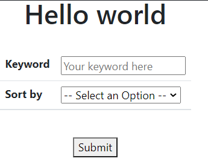

# Phần 5: Search và các kiểu sắp xếp

<a id = "p0"></a>

## Mục lục

- [Phần render Web của Thymeleaf](#p1)
- [Phần controller](#p2)

## Phần render Web của Thymeleaf

<a id = "p1"></a>

- Tại phần render Web của Thymeleaf `personSort.html` sẽ có 2 phần:

  - Phần đầu tiên dùng để hứng các yêu cầu tìm kiếm và sắp xếp từ phía trang web

    ```html
    <form th:action="@{/person/sort}" method="POST">
      <button type="submit">Submit</button>
    </form>
    ```

  - Phần thứ hai là để trả về kết quả thông qua cách render list được trả từ controller. Phần này có thể xem lại ở Phần 1, ở đây sẽ chỉ ghi lại code

    ```html
    <table class="table table-striped w-auto table-hover">
      <thead class="thead bg-success text-white">
        <tr>
          <th>ID</th>
          <th>Name</th>
          <th>Age</th>
          <th>Job</th>
          <th>Salary</th>
        </tr>
      </thead>
      <tbody class="tbody">
        <tr th:each="person:${personList}">
          <td th:text="${person.id}">ID</td>
          <td th:text="${person.name}">Name</td>
          <td th:text="${person.age}">Age</td>
          <td th:text="${person.job}">Job</td>
          <td th:text="${person.salary}">Salary</td>
        </tr>
      </tbody>
    </table>
    ```

- Quay lại phần đầu tiên, ta có một form trả kết `POST` request với http request là `/person/sort`

  ```html
  <form th:action="@{/person/sort}" method="POST">
    <button type="submit">Submit</button>
  </form>
  ```

- Ta sẽ cho gửi về cùng http request này 2 object: `keyword` chứa từ khóa tìm kiếm, và `sort` chứa kiểu sắp xếp mong muốn. Để trang trí đẹp mắt, ta sẽ để 2 object này vào trong một bảng:

  ```html
  <table class="table w-auto"></table>
  ```

- Object `keyword` sẽ được lấy thông tin qua một input nhập phím

  ```html
  <div th:object="${keyword}">
    <tr>
      <th>Keyword</th>
      <td>
        <input type="text" name="keyword" th:value="${keyword}" placeholder="Your keyword here" />
      </td>
    </tr>
  </div>
  ```

- Object `sort` sẽ được lấy thông tin thông qua một selection list

  ```html
  <div th:object="${sort}">
    <tr>
      <th>Sort by</th>
      <td>
        <select name="sort">
          <option th:selected="${#strings.equals(sort, '')}" value="">-- Select an Option --</option>
          <option th:selected="${#strings.equals(sort, 'jobInc')}" value="jobInc">Job (A - Z)</option>
          <option th:selected="${#strings.equals(sort, 'jobDec')}" value="jobDec">Job (Z - A)</option>
          <option th:selected="${#strings.equals(sort, 'ageInc')}" value="ageInc">Age by Increase</option>
          <option th:selected="${#strings.equals(sort, 'ageDec')}" value="ageDec">Age by Decrease</option>
        </select>
      </td>
    </tr>
  </div>
  ```

- Kết quả render sẽ như sau

  

[Quay lại Mục lục](#p0)

## Phần controller

<a id = "p2"></a>

- Ta sẽ cần một method để xử lý `POST` http request `/person/sort`. Do có sẵn phần render kết quả ở trang `personSort.html` nên ta sẽ trả kết quả về trang này luôn.

  ```java
  @PostMapping(value = "/person/sort")
  public String returnList(Model model) {
    return "personSort";
  }
  ```

- Vì có 2 object được trả về cùng trong http request là: `keyword` chứa từ khóa tìm kiếm, và `sort` chứa kiểu sắp xếp. Ta sẽ tìm cách hứng 2 object này thông qua annotation `@ModelAttribute`

  ```java
  @PostMapping(value = "/person/sort")
  public String returnList(@ModelAttribute("keyword") String keyword, @ModelAttribute("sort") String sort,
        Model model) {
  return "personSort";
  }
  ```

- Cuối cùng, ta thêm cách xử lý kết quả để trả về list cho việc render tại trang `personSort.html`

  ```java
  @PostMapping(value = "/person/sort")
  public String returnList(@ModelAttribute("keyword") String keyword, @ModelAttribute("sort") String sort,
    Model model) {
  model.addAttribute("personList", servicePerson.sortByOrder(servicePerson.getByKeyword(keyword), sort));
  return "personSort";
  }
  ```

[Quay lại Mục lục](#p0)

## Xử lý logic backend trả kết quả

<a id = "p3"></a>

- Phần xử lý dùng keyword để tìm các kết quả phù hợp từ list ban đầu

  ```java
  public List<Person> sortByKeyword(String keyword) {
      List<Person> result = listPerson.stream()
              .filter(p -> (p.getName().toLowerCase()
              .contains(keyword.toLowerCase())))
              .collect(Collectors.toList());
      return result;
  }
  ```

- Phần xử lý để sắp xếp danh sách từ danh sách chứa các phần tử đã được lọc bằng keyword

  ```java
  @Override
  public List<Person> sortByOrder(List<Person> list, String order) {
      List<Person> result = new ArrayList<Person>();
      if (order.isEmpty()) {
          return list;
      } else {
          switch (order) {
              case "jobInc":
                  result = list.stream()
                    .sorted((p1, p2) -> (p1.getJob().compareToIgnoreCase(p2.getJob())))
                    .collect(Collectors.toList());
                  break;
              case "jobDec":
                  result = list.stream()
                    .sorted((p1, p2) -> (p2.getJob().compareToIgnoreCase(p1.getJob())))
                    .collect(Collectors.toList());
                  break;
              case "ageInc":
                  result = list.stream()
                    .sorted((p1, p2) -> (p1.getAge() - p2.getAge()))
                    .collect(Collectors.toList());
                  break;
              case "ageDec":
                  result = list.stream()
                    .sorted((p1, p2) -> (p2.getAge() - p1.getAge()))
                    .collect(Collectors.toList());
                  break;
          }
          return result;
      }
  }
  ```

[Quay lại Mục lục](#p0)
