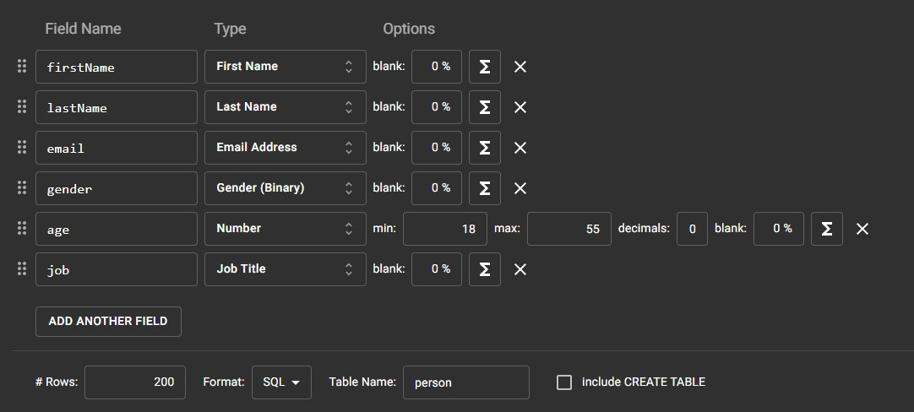

# Làm trang quản lý thông tin cá nhân

<a id = "p0"></a>

## Mục lục

-  [Dependency sử dụng](#p1)

## Dependency sử dụng

<a id = "p1"></a>

-  Trong phần này, ta cần sử dụng Dependency sau đây để có thể hoạt động: `Spring Web`, `Lombok`, `H2 Database`, `Spring Data JDBC`, `Spring Boot DevTools`, `Thymeleaf`, `Thymeleaf Layout Dialect`

[Quay lại mục lục](#p0)

## Bước 1: Tạo layout web

-  Trước hết, ta tạo controller cho thymeleaf

   ```java
   @GetMapping(value = { "/", "/index" })
   public String getHomePage(Model model) {
       model.addAttribute("active", "index");
       return "index";
   }
   ```

-  Tạo page layout cho thymeleaf để dùng làm web gốc

## Bước 2: Tạo đối tượng Person

-  Với một đối tượng Person, ta sẽ có 1 entity để tương tác với database, và một model để tương tác với page

-  Với person Entity, ta có các trường sau: `id`, `firstName`, `lastName`, `email`, `gender`, `age`, `job`, `avatar`. Đánh dấu `@Data`, `@Builder`

-  Với person Model, ta có các trường: `id`, `fullName`, `email`, `gender`, `age`, `job` và `avatar`. Đánh dấu `@Data`, `@Builder`

-  Tạo repository đối với personEntity, tiến hành thử dữ liệu với data đơn giản. Tạo hàm `list()`, với kết quả trả về là `List<PersonEntity>`

   ```java
       public personDAO() {
       listPerson.add(PersonEntity.builder()
       //build path
       .build());
   }

    @Override
    public List<PersonEntity> list() {
        return listPerson;
    }
   ```

-  Đối với service, tạo hàm `getList()`, kết quả trả về là `List<PersonModel>`. Hàm này có nhiệm vụ biến danh sách từ object `PersonEntity` thành danh sách với object `PersonModel`

   ```java
    @Override
    public List<PersonModel> getList() {
       List<PersonModel> returnList = personDAO.list()
               .stream()
               .map(personEntity -> PersonModel.builder()
               //build path
               .build())
               .collect(Collectors.toList());
       return returnList;
   }
   ```

-  Tại controller, tạo method trả về page `list.html` render kết quả thu được

   ```java
    @GetMapping(value = {"/list"})
    public String getListPage(Model model) {
       model.addAttribute("list", personService.getList());
       model.addAttribute("active", "list");
       return "list";
   }
   ```

-  Với page `list.html`, trong phần content trang trí nội dung như sau. Chú ý: mặc dù No. ở đây về sau sẽ giống ID, nhưng No. sẽ lấy giá trị từ việc đếm các phần tử trong list chứ không hề lấy giá trị ID từ trong database.
   ```html
   <section layout:fragment="content">
   	<br />
   	<br />
   	<div align="center">
   		<h1>People List</h1>
   		<br />
   		<table class="table table-striped w-auto">
   			<thead class="bg-success text-white text-center">
   				<tr>
   					<th>No.</th>
   					<th>Full Name</th>
   					<th>Email</th>
   					<th>Gender</th>
   					<th>Job</th>
   				</tr>
   			</thead>
   			<tbody class="tbody">
   				<tr th:each="person, iStat:${list}">
   					<td th:text="${iStat.count}">No.</td>
   					<td th:text="*{person.fullName}">Name</td>
   					<td th:text="*{person.email}">Email</td>
   					<td th:text="*{person.gender}">Gender</td>
   					<td th:text="*{person.job}">job</td>
   				</tr>
   			</tbody>
   		</table>
   	</div>
   </section>
   ```

## Bước 3: Tiến hành thiết lập Database

-  Lên trang [Mockaroo](https://www.mockaroo.com/), tiến hành cài đặt dữ liệu như sau

   

-  Trong file `application.properties` thêm các dòng sau

   ```
   spring.datasource.driverClassName=org.h2.Driver
   spring.datasource.url=jdbc:h2:mem:testdb
   spring.datasource.username=admin
   spring.datasource.password=123
   spring.datasource.platform=h2
   server-port = 8080
   ```

   Trong đó :

   -  `driverClassName`: quy định tên driver class trên h2-console
   -  `url`: quy định tên jdbc URL trên h2-console
   -  `username` và `password` để đăng nhập
   -  `platform`: quy định tên file `.sql` mà spring sẽ tự động truy cập khi khởi động. Tên 2 file `.sql` sẽ phải có tên như sau `schema-platform_name.sql` và `data-platform_name.sql`, trong đó `platform_name` là giá trị được quy định.

-  Trong mục `resources`, thêm file `schema-h2.sql`, với nội dung như sau

   ```sql
    CREATE TABLE person (
    id  BIGINT UNSIGNED NOT NULL AUTO_INCREMENT ,
   	firstName VARCHAR(20) NOT NULL,
   	lastName VARCHAR(50) NOT NULL,
   	email VARCHAR(50) NOT NULL,
   	gender VARCHAR(20) ,
    age INT ,
   	job VARCHAR(50),
   	avatar BLOB,
   	CONSTRAINT pk_id PRIMARY KEY(id)
   );
   ```

-  Tạo file `data-h2.sql`, với nội dung là dữ liệu được tạo ra từ trên trang mockaroo

   -  Spring sẽ tự động chạy hai file `schema-h2.sql` và `data-h2.sql` mỗi lần khởi động, thực hiện câu lệnh sql trong hai file này lên server h2

-  Chạy project Spring, sử dụng đường link `http://localhost:8080/h2-console/` để truy cập vào h2 database của project. Kiểm tra database với câu lệnh `SELECT * FROM person` xem dữ liệu đã được thêm vào database chưa.

## Bước 4.1: Render list từ Database

-  Để lấy được dữ liệu từ database, ta sẽ sửa lại DAO person để lấy dữ liệu từ database. Trước hết, ta bỏ phần thêm thông qua arrayList khai báo ban đầu

-  Thêm 2 parameter sau vào trong personDAO:

   ```java
    @Autowired
    private JdbcTemplate jdbcTemplate;
    private final RowMapper<PersonEntity> rowMapper
   ```

   Trong đó `JdbcTemplate` là class chứa các method tập trung vào việc tương tác với database, còn `RowMapper` là interface để `jdbc` liên kết dữ một bản ghi trong database đến một object trong java. Ta để rowmapper là `final` để parameter này có giá trị như nhau ở mọi object thuộc class personDAO

-  Khai báo thêm `@AllArgsConstructor` với personDAO để Spring tạo bean với parameter JdbcTemplate.

-  Giá trị của rowMapper được gán bằng lambda function như sau:

   ```java
   private final RowMapper<PersonEntity> rowMapper = (resultSet, rowNum) -> {
       PersonEntity personEntity = PersonEntity.builder()
       //build path
       .build();
       return personEntity;
   ```

-  Trong method list, sửa lại nội dung như sau:
   ```java
   @Override
   public List<PersonEntity> list() {
      String sql = "SELECT * FROM person";
      return jdbcTemplate.query(sql, rowMapper);
   }
   ```
   Trong đó `query` là method để lấy danh sách object thông qua việc lọc bản ghi với câu lệnh sql và ghép nối bản ghi với object thông qua rowMapper

## Bước 4.2: Giới hạn độ dài của list

-  Trong trường hợp có 1000 bản ghi thì độ dài của bảng là quá lớn. Vì vậy ta phải nghĩ cách để hạn chế list được render ra. Ở đây sẽ chọn hướng tương tác trên database

-  Trước hết, ta sẽ tạo tương tác trên web như sau:

   ```html
   <form class="view-choice" th:action="@{/list}" method="get" th:object="${view}">
   	<span>View as: </span>
   	<input type="radio" name="limit" value="5" id="5" th:checked="${view.limit == 5}" />
   	<label for="5">5 </label>
   	&nbsp;
   	<input type="radio" name="limit" value="10" id="10" th:checked="${view.limit == 10}" />
   	<label for="10">10</label>
   	&nbsp;
   	<input type="radio" name="limit" value="15" id="15" th:checked="${view.limit == 15}" />
   	<label for="15">15</label>
   	<input type="number" name="offset" hidden th:value="${view.offset}" />
   	<br />
   	<input th:if="${view.offset != 0}" class="btn btn-info" type="submit" name="move" value="Prev" />
   	&nbsp;&nbsp;
   	<input class="btn btn-info" type="submit" name="move" value="Next" />
   </form>
   ```

   Bảng này sẽ trả một request param với các trường: `limit`, `offset` và `move`.

-  Tạo ra một class `View` với hai trường `limit` và `offset` với kiểu dữ liệu `Integer`.

-  Sửa lại Get request cho "/list" như sau:

   ```java
    @GetMapping(value = {"/list"})
    public String getListPage(Model model,
           @RequestParam(required = false, value = "limit") Integer limit,
           @RequestParam(required = false, value = "offset") Integer offset,
           @RequestParam(required = false, value = "move") String move) {
       View view = new View();
        view.setLimit(limit == null ? 10 : limit);
        view.setOffset(offset == null ? 0 : offset);
       System.out.println(move);
       if (move != null) {
           switch (move) {
               case "Prev":
                    int newOffset = view.getOffset() - view.getLimit();
                    view.setOffset(newOffset < 0 ? 0 : newOffset);
                   break;
               case "Next":
                   view.setOffset(view.getOffset() + view.getLimit());
                   break;
           }
       }
       model.addAttribute("list", personService.getList(view.getLimit(), view.getOffset()));
       model.addAttribute("active", "list");
       model.addAttribute("view", view);
       return "list";
   }
   ```

-  Sau mỗi lần sumbit, giá trị `offset` và `limit` sẽ được tính toán lại rồi truyền lên lên web qua object `view`, kèm danh sách thu được qua câu lệnh sql

-  Ở phần service, ta tạo ra một method private đảm nhiệm việc mapping dữ liệu từ entity thành model để tránh lặp lại code. Sau đó overloading method `getList` với dữ liệu truyền vào là `limit` và `offset`.

   ```java
    @Override
    public List<PersonModel> getList(Integer limit, Integer offset) {
        return mappingEntityToModel(personDAO.list(limit, offset));
    }
   ```

-  Với phần repository, overloading method `list` với dữ liệu truyền vào là `limit` và `offset`:
   ```java
       @Override
   public java.util.List<PersonEntity> list(Integer limit, Integer offset) {
       String sql = "SELECT * FROM person LIMIT ?, ?";
       return jdbcTemplate.query(sql, rowMapper, offset, limit);
   }
   ```

## Bước 5: Tiến hành view từng ID riêng lẻ. Render ảnh avatar default

-  Câu lệnh tiến hành tại DAO

   ```java
       @Override
   public PersonEntity getID(Long id) {
       String sql = "SELECT * FROM person WHERE id = ?";
       PersonEntity personEntity = jdbcTemplate.queryForObject(sql, rowMapper, id);
       return personEntity;
   }
   ```

-  Tại controller, kiểm tra xem đối tượng có avatar chưa, dựa vào đó gán giá trị rồi truyền qua trang html

   ```java
       @GetMapping("/view_{id}")
   public String getViewPage(@PathVariable(value = "id") Long id, Model model) {
       PersonModel personModel = personService.getByID(id);
       boolean hasAvatar = false;
       if (personModel.getAvatar() != null) {
           hasAvatar = true;
       }
       model.addAttribute("person", personService.getByID(id));
       model.addAttribute("hasAvatar", hasAvatar);
       model.addAttribute("active", "view");
       return "view";
   }
   ```

-  Tiến hành render tại trang html
   ```html
   <tr>
   	<td class="text-capitalize fw-bold">Avatar</td>
   	<td class="avatar">
   		
   	</td>
   </tr>
   ```

## Bước 6: Xử lý exception: ID not found

-  Ví dụ như trong trường hợp chỉ có 100 bản ghi mà ta lại đi nghịch ngợm trên url tìm bản ghi thứ 101 thì đương nhiên sẽ nhảy ra một Exception. Trong trường hợp này, exception sẽ là `EmptyResultDataAccessException`.

-  Exception này sẽ xảy ra đầu tiên tại `personDAO`, tuy nhiên ta sẽ không xử lý ngay tại đây mà cho method ném ra một Exception: `EmptyResultDataAccessException` hoăc `DataAccessException` (exception cha)

   ```java
       @Override
   public PersonEntity getID(Long id) throws DataAccessException {
       String sql = "SELECT * FROM person WHERE id = ?";
       PersonEntity personEntity = jdbcTemplate.queryForObject(sql, rowMapper, id);
       return personEntity;
   }
   ```

-  Kế đến, ta sẽ xử lý tiếp bước tiếp theo Exception xuất hiện. Do ta cho method `getID` của `personDAO` throws exception (và vì vậy không cần xử lý), việc xử lý exception được đẩy sang cho method tiếp theo có gọi method này: `getByID` của `personService`. Tiếp tục cho throws exception ở đây:

   ```java
    @Override
    public PersonModel getByID(Long id) throws DataAccessException {
        PersonModel personModel = objectMappingEntityToModel(personDAO.getID(id));
        return personModel;
    }
   ```

-  Method cuối cùng trong chương trình phải xử lý exception này chính là method `getViewPage` của controller

   ```java
       @GetMapping("/view_{id}")
        public String getViewPage(@PathVariable(value = "id") Long id, Model model) {
       PersonModel personModel = personService.getByID(id);
       boolean hasAvatar = false;
       if (personModel.getAvatar() != null) {
           hasAvatar = true;
       }
       model.addAttribute("person", personModel);
       model.addAttribute("hasAvatar", hasAvatar);
       model.addAttribute("active", "view");
       return "view";
   }
   ```

-  Để bắt và xử lý exception ở đây, ta sẽ tạo ra một class có annotation `@ControllerAdvice` chuyên xử lý các exception từ class có annotation `@Controller`

   ```java
   @ControllerAdvice
   public class PersonExceptionHandler extends ResponseEntityExceptionHandler {
   @ExceptionHandler(EmptyResultDataAccessException.class)
   public String handleEmptyResultDataAccessException(EmptyResultDataAccessException ex,
           Model model) {
       model.addAttribute("errorCause", ex.getClass().toString());
       model.addAttribute("errorMes", "The id is not found!");
       return "errorPage";
       }
   }
   ```

   -  `ExceptionHandler` sẽ chú thích exception nào sẽ được bắt và xử lý như thế nào. Chú ý kết quả trả về là ta đẩy sang trang `errorPage.html`

## Bước 7: Edit ID, upload ảnh lên database, render ảnh, valid các trường

-  Là một hành động tác động tới database, việc edit dữ liệu cần được gửi thông qua POST request.

-  Giới hạn ảnh tải lên server trong mục `application.properties`

   ```
   spring.servlet.multipart.max-file-size = 5MB
   spring.servlet.multipart.max-request-size = 5MB
   ```

-  Tiến hành thêm các trường sau vào personModel

   ```java
    private MultipartFile avatarUpload;
    private String avatarBase64;
   ```

-  Vì upload từ website lên server sẽ có định dạng là `MultipartFile`, ta cần chuyển định dạng này về dạng byte[] để lưu vào database

   ```java
           if (!personModel.getAvatarUpload().isEmpty()) {
           personModel.setAvatar(personModel.getAvatarUpload().getBytes());
       }
   ```

-  personModel sẽ được chuyển qua `@Service` để chuyển thành file DAO tương tác với server

   ```java
    private PersonEntity objectMappingModelToEntity(PersonModel model) {
        PersonEntity personEntity = PersonEntity.builder()
            //build path
            .build();
        return personEntity;
        }

        @Override
        public void update(Long id, PersonModel model) {
            personDAO.update(id, objectMappingModelToEntity(model));
        }
   ```

-  Sau đó tiến hành lưu thông tin vào trong database như sau

   ```java
    @Override
    public void update(Long id, PersonEntity object) {
    String sql =
            "UPDATE person SET firstName = ?, lastName = ?, email = ?, gender = ?, age = ?, job = ?, avatar = ? WHERE id = ?";
    jdbcTemplate.update(sql, object.getFirstName(), object.getLastName(),
        object.getEmail(), object.getGender(), object.getAge(), object.getJob(), object.getAvatar(), id);
    }
   ```

-  Để render được ảnh từ database lên website, khi đưa dữ liệu qua service cần chuyển từ dạng byte[] sang dạng String Base64

   ```java
   if (personModel.getAvatar() != null) {
       personModel.setAvatarBase64(Base64.getEncoder().encodeToString(
                       personModel.getAvatar()));
   }
   ```

-  Sau đó dùng String Base64 tạo thành để render thành ảnh :
   ```html
   
   ```

## Bước 8: Add và delete ID

## Bước 9: Search
